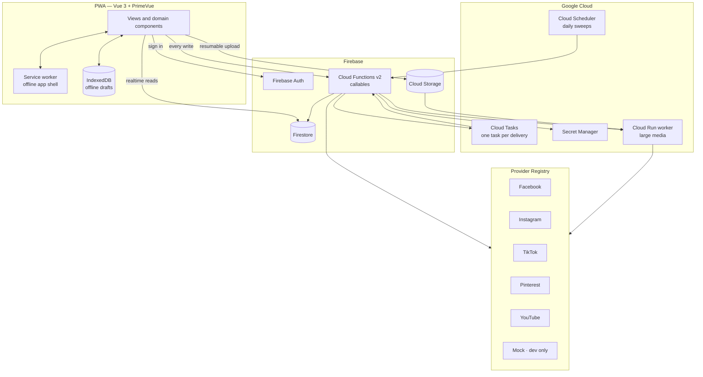
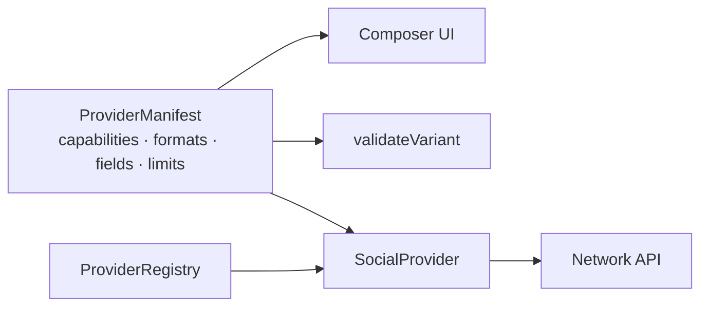
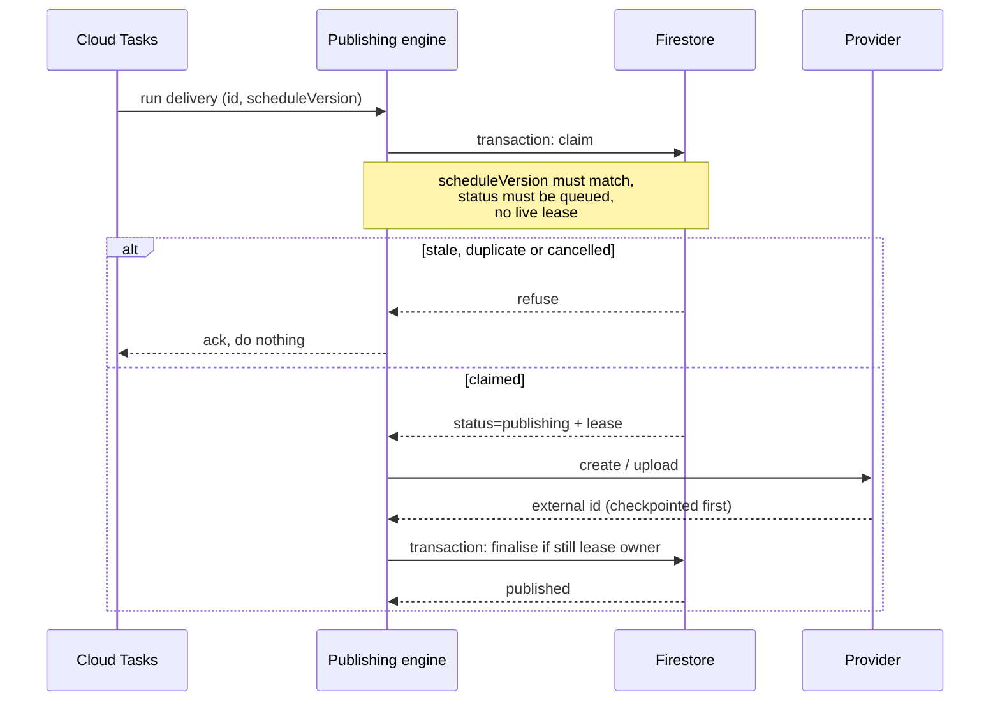
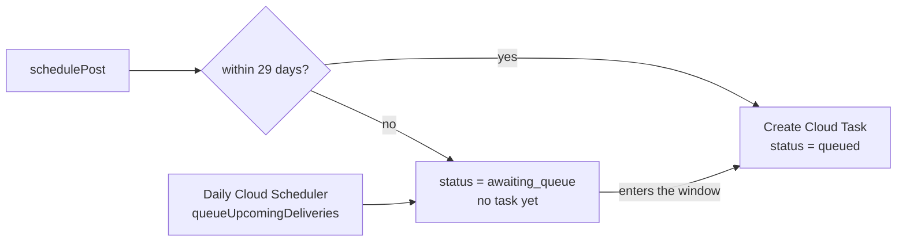
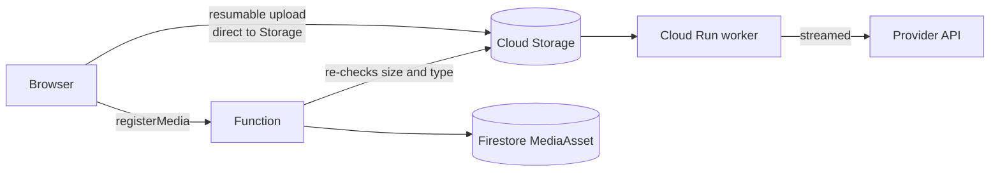

# Architecture

CrepeLite Social Hub is a mobile-first PWA in front of a Firebase backend that
fans one post out to many social networks, each delivered independently.

Two ideas drive most of the design:

1. **Deliveries are independent.** One post produces one delivery per
   destination. They succeed or fail separately, and a retry touches exactly
   one of them.
2. **Publishing must never happen twice.** Cloud Tasks guarantees *at-least*
   once delivery, so the engine has to supply the "at most once" half itself.

---

## System overview

The client **never writes to Firestore**. Rules refuse it outright; every
mutation goes through a typed callable that re-validates the payload with the
same zod schema the client used and checks the caller's role.

---

## Layers

| Layer | Lives in | Responsibility |
| --- | --- | --- |
| `shared/` | imported by all | Domain types, provider manifests, scheduling maths, validation, zod schemas. The contract. |
| `src/` | browser | Rendering, composing, offline drafts, direct media upload. |
| `functions/` | Cloud Functions v2 | Every write, OAuth, scheduling, publishing, reconciliation, webhooks. |
| `worker/` | Cloud Run | Streams large media to providers. |

`shared/` is why client and server cannot disagree: the composer's "this caption
is too long" and the backend's rejection are the same function.

---

## Provider architecture

A network is described by a **manifest** (client-safe, secret-free) and
implemented by a **provider** (server-only).

The manifest declares what the network supports; the UI renders itself from
that. There is no `if (provider === 'instagram')` anywhere in the core — the
composer, the connections screen and the network picker all read capabilities.

Adding a network is one manifest plus one provider: see
[`adding-provider.md`](./adding-provider.md).

---

## Publishing one delivery

### Idempotency

Five mechanisms, each closing a different hole:

| Mechanism | Stops |
| --- | --- |
| `scheduleVersion` on task and delivery | An old task firing after a reschedule |
| Transactional claim on `status === 'queued'` | Two tasks racing for the same delivery |
| Time-bounded **lease** owned by the execution | A second run starting while the first is alive |
| Provider **checkpoints** written before irreversible calls | Re-creating a post whose outcome is unknown |
| Finalise only **if still lease owner** | A revived zombie execution overwriting a newer result |

A delivery whose lease expired mid-publish is never republished blindly. The
engine resolves the real outcome through the provider's status API using the
checkpoint, or marks it `outcome_unknown` — and that state requires an explicit
human confirmation before a retry, because the alternative is a duplicate post.

### Rescheduling

Rescheduling increments `scheduleVersion` and enqueues a new task. The old task
still fires — Cloud Tasks cannot always be cancelled — but the version no longer
matches, so the engine ignores it. The stale task is a harmless no-op by design,
not by luck.

---

## The 30-day queue window

Cloud Tasks refuses a schedule more than 30 days out, but people plan further
ahead than that. So scheduling has two layers:

`QUEUE_WINDOW_DAYS` is 29, deliberately short of the 30-day limit so a slow
sweep never bumps into it. The sweep is idempotent and safe to run repeatedly.

---

## Reconciliation

A periodic job repairs states nothing else will:

- Deliveries stuck in `publishing` with an expired lease.
- Deliveries `queued` whose Cloud Task vanished.
- Asynchronous provider processing that timed out.
- Connections whose tokens expired.
- Posts published externally where the local status never caught up.

Recovery re-enqueues with a **time-bucketed task id**, so repeated
reconciliation runs inside the same bucket collapse into one task — Cloud Tasks
will not reuse a task name immediately after it ran.

---

## Media

Originals go **straight from the browser to Storage** — never through a
Function, which would have to buffer up to 4 GB in memory. `registerMedia` then
verifies the stored object's real size and content type before creating the
`MediaAsset` document, so a client cannot lie about what it uploaded.

Large videos are streamed to providers by the **Cloud Run worker**, which has
no such memory ceiling. It scales to zero and is invoked with authenticated
tasks only.

---

## Security

| Concern | How |
| --- | --- |
| Client writes | Firestore rules deny all writes. Every mutation is a callable. |
| Workspace isolation | Rules check membership on every read; `tests/rules` proves A cannot read B. |
| Provider tokens | Encrypted in a server-only collection. Never in Firestore documents a client can read, never in the bundle, never in `localStorage`. |
| Secrets | Google Secret Manager, bound to functions. Never committed. |
| OAuth | `state` + server-side nonce, PKCE where supported, single-use short-lived state records, exact redirect-URI matching. |
| Storage | Objects are immutable and undeletable by clients; size, content type, id shape and filename are enforced in rules. |
| Server-only fields | `externalPostId`, `taskName`, `status`, `publishingLease` can only be written by the backend. |
| Logs | Tokens, authorisation codes and secret headers are redacted before anything is logged. |

---

## AI captions

Caption generation follows the same registry pattern as the social providers:
`AIContentProvider` behind `AIProviderRegistry`, so the vendor is a
registration rather than a dependency spread through the code. The model only
ever returns text — it has no path to the publishing engine, so it cannot
publish. Media is read server-side with the admin SDK rather than being made
public, and video frames are extracted in the browser because Cloud Functions
have no ffmpeg. Spend is capped per workspace and reserved before the call.

Full detail in [`ai-caption-generator.md`](./ai-caption-generator.md).

## Cost

The scheduler is event-driven, not polled. There is no minute-by-minute scan:
Cloud Tasks fires at the exact moment, and only the daily sweep and
reconciliation run on a timer.

- Cloud Run `minInstances = 0`.
- Queries are cursor-paginated and bounded; no unbounded listeners.
- Large media never passes through a Function.
- Provider configuration is static and cached.
- Realtime listeners only where the screen genuinely needs live data.

---

## Offline

The service worker precaches the app shell, so the PWA opens without a network.
Composer drafts are mirrored into IndexedDB on every change and restored on
reopen, including after a crash. Firestore's own persistence serves recently
read data. Writes need a connection, and the UI says so rather than pretending
to have saved.
